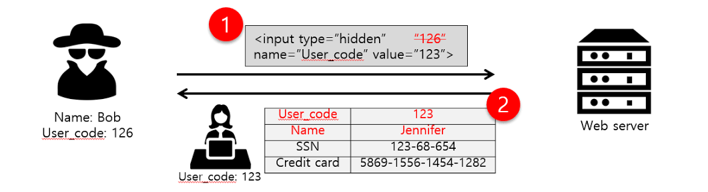
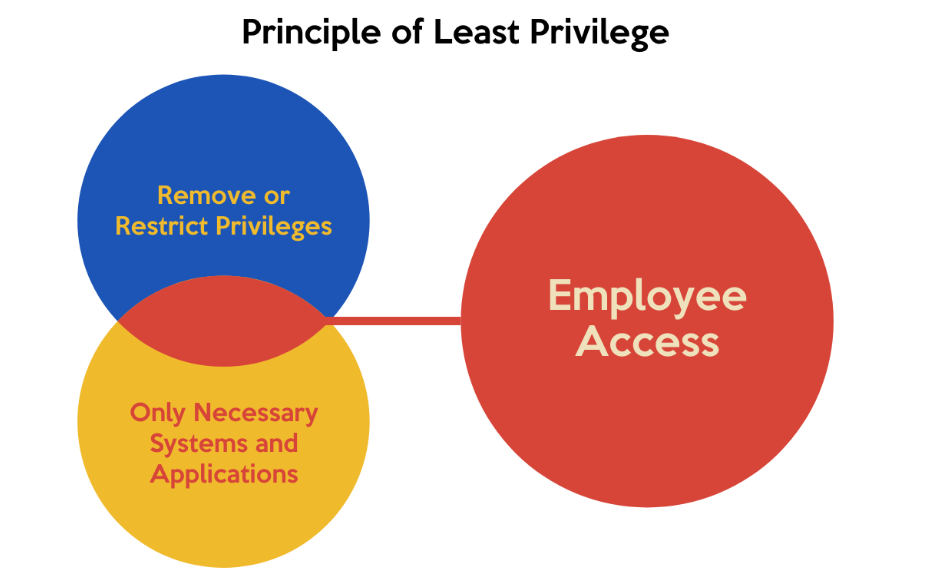

- From 2017 to 2017, Broken Access Control climp from top 5th to 1st.

- These thing can prove that it's the most critical security vulnerability in web applications.

    **Let's talk about it**:
- Broken Access Control is a security vulnerability that occurs when an application fails to properly restrict users from accessing resources or performing actions they are not authorized for. In other words, it allows users to bypass access controls and gain unauthorized access to data, functions, or systems.

    

- This is the most classic case of BAC, imagine a banking application where a regular user can access another user’s account details simply by changing a parameter in the URL, like switching */account?userId=123* to */account?userId=456*. If the application doesn’t verify the request... BOOM! You have successful access user with id 456 whether your id is 123.

- Broken Access Control occurs due to several underlying issues in the design, implementation, or configuration of an application:
    + Lack of authentication properly: Do not perform correctly to ensure that users have necessary access.
    + Granting deviations: Providing privilege exceeds the necessary level for users.
    + Lack of access inspection: Do not check access to each resource access request.
    + Programming errors: Programming errors allow users to pass access tests.

- Another examples, imagine a Content Management System(CMS) allow ADMIN to provide privileges to another user. However, due to programming errors, the system does not properly check the role of the user when performing change privileges. Normal users can send the HTTP request directly to the System's API to change their privileges by edit data in the request. => Normal users can become ADMIN 

- Through these examples, you can see severity of BAC, attackers can gain full control of the application or underlying server that lead to leak data of customers, money,... Bad affect and complex to all coporations and oraganizations related to,... 

- To against BAC:
    + Use Least Privilege: Users should be provided minimum privileges for thier missions.
    
    + Avoid IDOR(A method that closely to BAC) with python code example:
        *if current_user.id != requested_user_id and not current_user.is_admin:*
        *return "Access Denied", 403*
    + Ensure that users are properly authenticated before accessing sensitive resources.
    + Validate and sanitize all user inputs, especially parameters that reference objects(e.g., userId,...). Reject any requests that attempt to access unauthorized resources.
    + Use security frameworks that provide built-in access control mechanisms, such as Spring Security (Java), Django’s permission system (Python), or Laravel’s middleware (PHP).